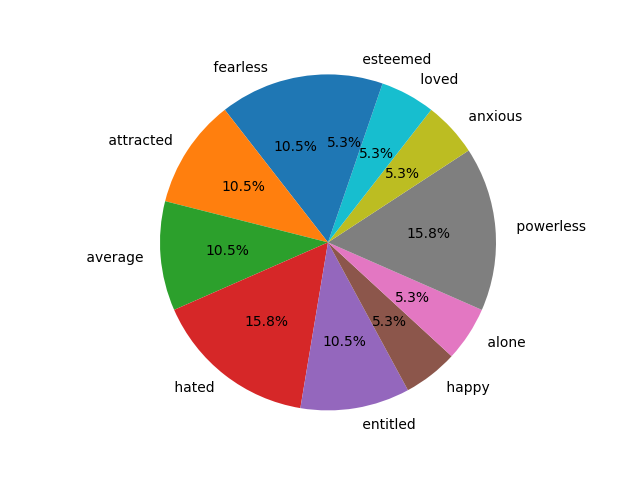

# Sentiment Analysis of Resignation Letter




This project analyzes the sentiment of a resignation letter using natural language processing techniques. It includes Python code for sentiment analysis and emotion recognition, and visualizes the results in a pie chart.

## Files

- `sentiment_of_resignationletter.py`: Python script for sentiment analysis.
- `resignation.txt`: Sample resignation letter text.
- `status.txt`: Current project status.
- `graph.png`: Bar chart representing emotion distribution.
- `pie_chart.png`: Pie chart representing sentiment distribution.

## Getting Started

### Prerequisites

- Python 3.x
- Matplotlib library

### Installation

1. Clone the repository:

```bash
git clone https://github.com/frtpynrc/sentiment_of_resignationletter.git
cd sentiment_of_resignationletter
